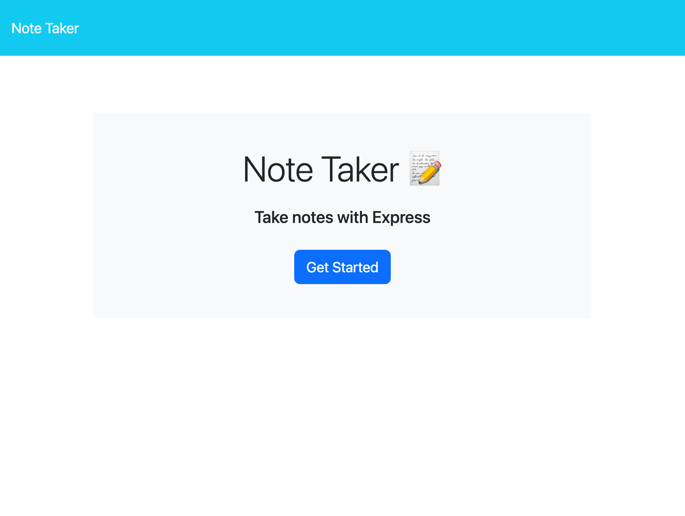
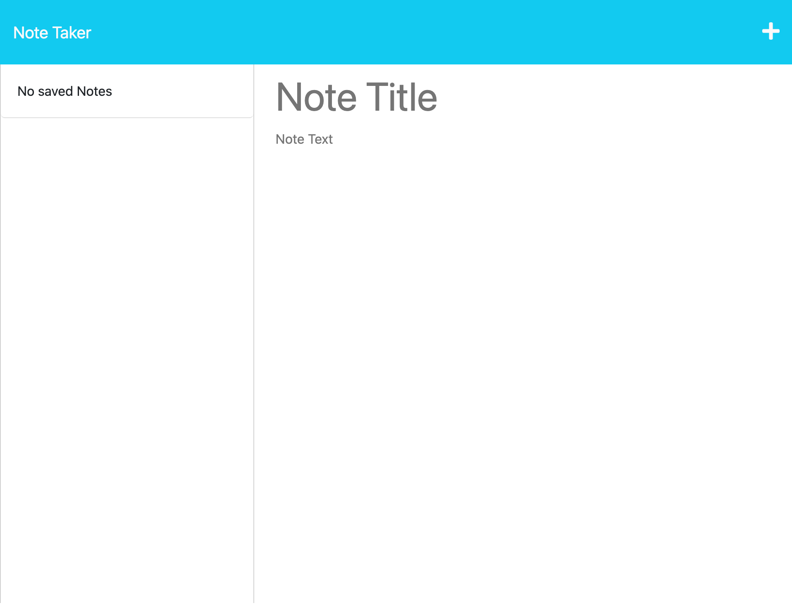
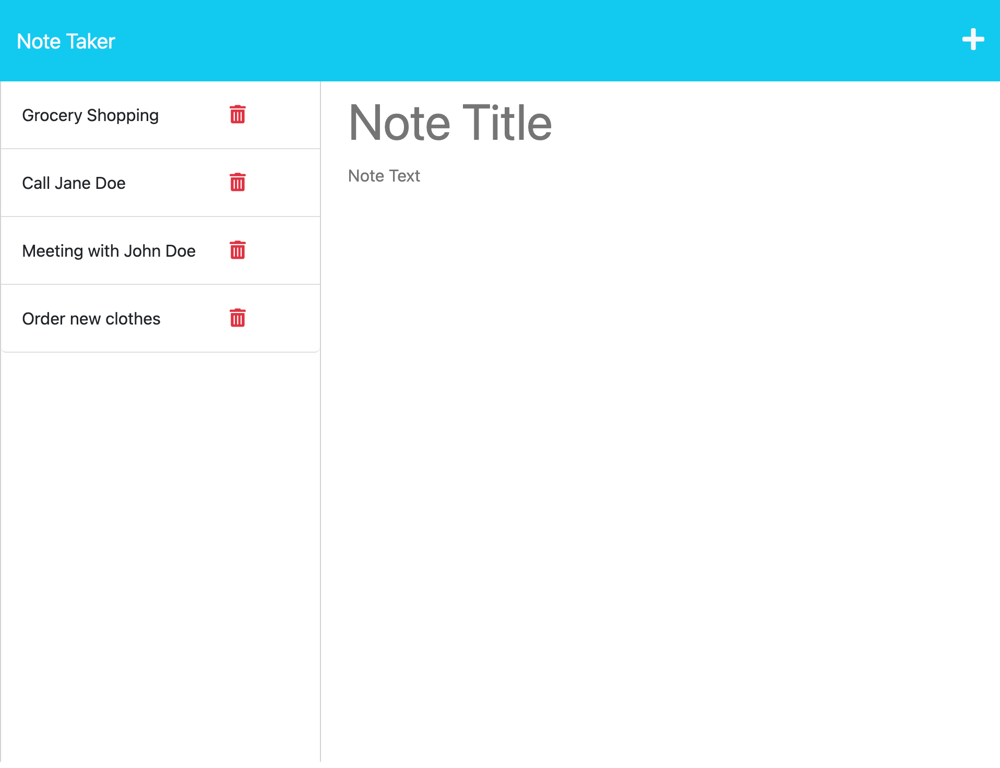
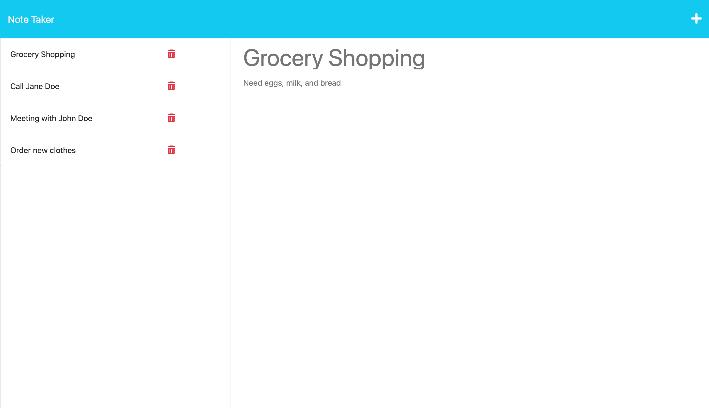

# note-taker-app

## Description

I was motivated to build a fullstack application that allows users to write notes in order to remain organized, creating a database on the backend with the notes the user writes. I built this project to provide users a simple way to keep track of the tasks they must complete and give them the ability to add new tasks and view previously written tasks. This application solves the problem of creating a fullstack application that can curate a list of notes for the user, save the notes on the backend, and render new and previously written notes on the page. Furthermore, this app solves the problem of creating functional routes in Express.js that adds new data to the existing database. This project uses HTML, CSS, JavaScript, node.js, and express.js to create full functionality. I learned how to connect the frontend to the backend throughout this process, use routing with Express.js effectively, and create my own database.

## Usage

Upon navigating to the site, the user can click on the "Get Started" button as seen in image one. The user will be taken to the "Notes" page where they can begin to add new notes, as seen in image two. Once the user types in the title of their note AND the text of their note, they can hit the "Save" icon and their note will be saved and render on the left of the screen, as seen in image three. If the user wishes to view a previously saved note, they can click on the note in the left hand side and it will repopulate on the right hand side, as seen in image four. Furthermore, if the user has a previously written note in the large note body of the page, they can click the "+" and the previous note will be cleared from the body and they will be able to write a new note. If you would like to delete a note, clicking the trashcan icon next to the note will remove it from the page. Here is a link to the deployed app! https://still-tundra-31736.herokuapp.com/ 

## How to Contribute

If you would like to contribute to this application, please reach out to me via email kendrajfitzgerald@gmail.com. I would love any advice on how to improve this project!
